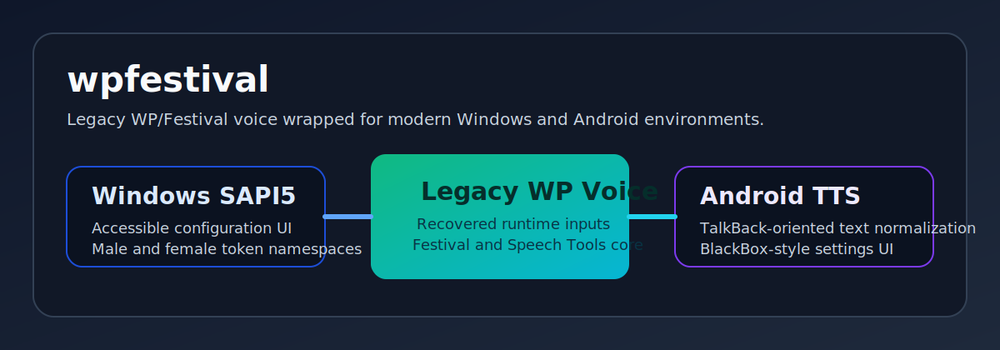

# wpfestival

Reverse-engineered tooling and wrappers around the legacy Polish WP/Festival voice, prepared in two forms:

- Windows SAPI5 wrapper with accessible configuration UI
- Android `TextToSpeechService` with TalkBack-oriented text normalization

## Downloads

For end users:

- Windows installers: https://github.com/TurekCom/wpfestival/releases/tag/windows-sapi5-source-v0.4.1
- Android APK: https://github.com/TurekCom/wpfestival/releases/tag/android-source-v0.2.12
- Android Festival variants APKs: https://github.com/TurekCom/wpfestival/releases/tag/android-festival-variants-v0.1.2

For source archives:

- Windows SAPI5 source package is attached to the Windows release
- Android source package is attached to the Android release

## Quick start

### Windows

1. Download the `.exe` installer from the Windows release page.
2. Install the male and optionally the female package.
3. Restart your screen reader or any SAPI host after installation.
4. Open the installed configuration shortcut to tune variant, rate, volume, and pitch.

### Android

1. Download the `.apk` from the Android release page.
2. Install the APK and select `WP Festival` as the system TTS engine.
3. Open the settings screen to choose profile, variant, dictionary file, emoji reading, and punctuation verbosity.

Separate Android builds for `Festival Polski MBROLA` and `Festival Polski Multisyn` are published in the Android Festival variants release.

The git history is intentionally **source-first**. It does **not** track the proprietary WP runtime, voice database, recovered installers, or release keys.

## Repository layout

- `windows/`
  Windows SAPI5 engine, config UI, installer scripts, PowerShell install helpers.
- `android/`
  Android app source for the TTS engine and settings UI.
- `third_party/`
  Upstream Festival and Edinburgh Speech Tools sources used as the base for local rebuilds.
- `docs/`
  Build notes, legal notes, and historical project status snapshots.
- `runtime/`
  Placeholder location for locally supplied proprietary runtime files. Not tracked in releases.

## What is not tracked in git

- original WP installer payloads
- recovered `wp_runtime_lib`
- rebuilt `festival.exe`
- Android `jniLibs` outputs
- release signing keys

Those parts are excluded on purpose. See [docs/LEGAL.md](docs/LEGAL.md) and [docs/BUILDING.md](docs/BUILDING.md).

## Components

### Windows SAPI5

Located in [windows/README.md](windows/README.md).

Highlights:
- accessible Win32 configuration UI
- separate male and female token namespaces
- preset-based variants
- machine-wide or per-user registration scripts

### Android TTS

Located in [android/README.md](android/README.md).

Highlights:
- `TextToSpeechService` for Android
- settings UI inspired by BlackBox
- emoji and punctuation verbosity controls
- aggressive text normalization for old Festival runtime

## Historical notes

The original working notes from the reverse-engineering session are preserved as:

- [ANALYSIS.md](docs/ANALYSIS.md)
- [SAPI5_STATUS.md](docs/SAPI5_STATUS.md)
- [ANDROID_WP_FESTIVAL_STATUS.md](docs/ANDROID_WP_FESTIVAL_STATUS.md)

Additional repository documentation:

- [docs/ARCHITECTURE.md](docs/ARCHITECTURE.md)
- [CHANGELOG.md](CHANGELOG.md)

## License

Repository glue code and documentation are provided under the MIT license in [LICENSE](LICENSE).

Upstream Festival and Speech Tools keep their original licenses in `third_party/`.
